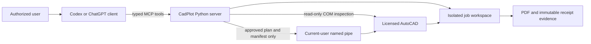

# ChatGPT connection architecture

## What the user can say

A user can ask a connected client to inspect a configured project folder, create dry-run plans,
stage exact approved plans, queue exact approved manifests, and audit the resulting PDFs. The model
chooses typed CadPlot tools; it does not generate AutoLISP, shell commands, or arbitrary AutoCAD
commands.

"Upload the DWG to ChatGPT" is not the normal architecture. The DWG stays inside an authorized
local source root. A local client passes its path to the local MCP server. For ChatGPT web, a
managed bridge must route an authorized job reference to a registered workstation without exposing
the workstation filesystem as a general remote service.

For a local client, `C -> P` is `stdio` on the workstation. For ChatGPT web, only that edge changes:
it becomes a company-authorized Secure MCP Tunnel during development or an authenticated HTTPS
Streamable HTTP `/mcp` gateway in production. Everything from `P` onward remains workstation-local.

## Required operation sequence

1. Validate configuration, allowed roots, workspace separation, and the AutoCAD connection.
2. Inspect the exact DWG and create a deterministic dry-run plan.
3. Resolve every blocker and optionally preview the ready plan with the plug-in.
4. Obtain explicit approval for the exact `plan_id`; then stage an isolated copy.
5. Validate the staged manifest with the plug-in.
6. Obtain explicit approval for the exact `plan_id` and `manifest_sha256`; then queue publishing.
7. Read terminal receipt evidence and audit every expected PDF.
8. Report completion only when the final audit returns both `source_unchanged=true` and
   `publish_verified=true`.

The MCP server advertises this sequence in its server instructions and marks local write tools with
write annotations. Client approvals remain mandatory because annotations are descriptive hints,
not authorization.

## Implemented and unimplemented boundaries

Implemented in this repository:

- local `stdio` MCP server;
- loopback-only Streamable HTTP `/mcp` endpoint for an authorized local tunnel;
- secret-free `cadplot-tunnel-preflight` report and administrator command handoff;
- optional validated Codex plugin wrapper;
- local Python/AutoCAD named-pipe protocol;
- approval-bound staging and publishing;
- immutable receipt and PDF audit evidence.
- a canonical, hash-bound 13-case ChatGPT tool-selection evaluation plan and sanitized result
  validator.

Not implemented or claimed:

- a hosted Streamable HTTP gateway;
- OAuth, mutual TLS, device enrollment, or organization user mapping;
- Secure MCP Tunnel provisioning;
- public ChatGPT plugin submission;
- live AutoCAD 2016 and 2025 acceptance evidence.

Those are separate delivery gates. A successful local synthetic test or compile probe must never be
presented as proof of any of them.

After the external tunnel and ChatGPT app scan pass, use the
[ChatGPT tool-selection evaluation](chatgpt-evaluation.md) to retain direct, indirect, follow-up,
approval, adversarial, and edge-case evidence. A passing evaluation proves the connected model/tool
contract only; it deliberately keeps live publish and licensed AutoCAD acceptance claims false.

The recommended tunnel target is installed `cadplot-mcp` over STDIO. The alternative loopback
endpoint is started with `cadplot-mcp-http --port 8765`. It is not a hosted gateway:
there is no public bind option, browser Origin requests are rejected, and the request body is capped
at 1 MiB. See [Secure MCP Tunnel handoff](secure-tunnel-handoff.md) and
[loopback Streamable HTTP transport](loopback-http.md).
